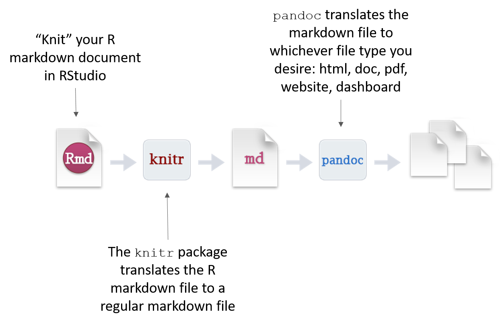

<br>

**CONTENTS**

-----------------------

* TOC
{:toc}

-----------------------

<br>

# What Are Data-Driven Docs?

Data-driven documents are formats that combine text and analysis (data+code). 

In doing so, they promote transparency and reproducability. For any given table, figure, or model in the document you should be able to easily discern how it was created, from what data, and what analysis was used. 

Popular formats include things like [R Markdown](https://rmarkdown.rstudio.com/lesson-1.html) documents and [Jupyter notebooks](https://jupyter.org/try).


# How Do Data-Driven Docs Work?

All of the document formats build from a simple text formatting convention called **markdown**. 

To create an R Markdown document, you need three things:

1. A header to specify the document type.  
2. Some text (formatted in markdown).  
3. Some code (enclosed by fences).  


You can download a sample template [HERE](https://cdn.rawgit.com/DS4PS/Data-Science-Class/c464d527/TEMPLATES/MarkdownTemplateSimple.Rmd).


# What is Markdown?

Markdown is a simple set of rules used to format text. It has been adopted broadly by the data science community and is used on GitHub, Stackoverflow, and now in R Studio. 

To give just a couple of examples of how it works:

**Unordered Lists**

```
* First item
* Second item
* Third item
    * First nested item
    * Second nested item
```
* First item
* Second item
* Third item
    * First nested item
    * Second nested item


**Hyperlinks**

Create links by wrapping the link text in square brackets [ ], and the URL in adjacent parentheses ( ). 

```
[Google News](https://news.google.com)
```

[Google News](https://news.google.com)

**Tables**

```
| Title 1          | Title 2          | 
|------------------|------------------|
| First entry      | Second entry     |  
| Third entry      | Fourth entry     |  
| Fifth entry      | Sixth entry      |


```

| Title 1          | Title 2          |  
|------------------|------------------|  
| First entry      | Second entry     |  
| Third entry      | Fourth entry     |  
| Fifth entry      | Sixth entry      |  


You can see a full list of rules [HERE](https://ds4ps.org/data-driven-management-textbook/markdown/).

<br>


# Knitting R Markdown Files

<br> 



When you "knit" a file R Studio will run all of code, embed the output into your document, and then convert the file to whichever type you have specified in the file header.  


# Output Types

You can select from many different document types, including HTML pages, Microsoft word, presentation formats, or dashboards.

<br>


**Check out:**

[R Markdown Formats](https://rmarkdown.rstudio.com/formats.html)  
[R Markdown Gallery](https://rmarkdown.rstudio.com/gallery.html)  

<br>


### HTML Pages

```r
---
output: html_document
---
```

### PDFs

```r
---
output: pdf_document
---
```

### Dashboards

```r
---
output: flexdashboard::flex_dashboard:
---
```

[](../gifs/DashboardExample/DashboardExample2.html)


[ [dashboard example](https://cultureofinsight.shinyapps.io/crypto_tracker/) ]  [ [source code](https://cultureofinsight.shinyapps.io/crypto_tracker/) ]  [ [blog about the tracker](https://www.cultureofinsight.com/blog/2018/01/22/2018-01-22-building-a-cryptocurrency-tracker-with-r/) ]  


# Installation

You will need the following programs to generate data-driven documents in R:

* Base R installation [CRAN](https://www.r-project.org/)
* R Studio 
* Pandoc (comes with R Studio by default)

https://www.reed.edu/data-at-reed/software/R/r_studio_pc.html

Specialized packages:

* rmarkdown templates 
* dashboards 
* shiny 


<br>
<br>


<br>

----------------

<br>


<style>
p {
  margin-top:20px !important;
  margin-bottom:20px;
    }  
h6{
  font-size:calc(2em + 0.25vw) !important;
  color: #337ab7;
  font-weight:300;
  margin-top:60px !important;
  margin-bottom:20px;
  } 

#markdown-toc a {
  color: black;
  font-size:calc(0.75em + 0.25vw);
  line-height:1.2;
}  
#markdown-toc a:hover {
    color: black;
    text-decoration: none;
    font-weight: bold;
}
</style>
