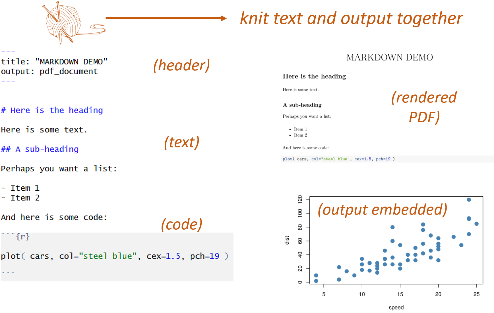

<br>

**CONTENTS**

-----------------------

* TOC
{:toc}

-----------------------

<br>

# What Are Data-Driven Docs?

Data-driven documents are formats that combine text and analysis (data+code). 

In doing so, they promote transparency and reproducability. For any given table, figure, or model in the document you should be able to easily discern how it was created, from what data, and what analysis was used. 

Popular formats include things like [R Markdown](https://rmarkdown.rstudio.com/lesson-1.html) documents and [Jupyter notebooks](https://jupyter.org/try).


# How Do Data-Driven Docs Work?

All of the document formats build from a simple text formatting convention called **markdown**. 

To create an R Markdown document, you need three things:

1. A header to specify the document type.  
2. Some text (formatted in markdown).  
3. Some code (enclosed by fences).  



You can download a sample template [HERE](https://cdn.rawgit.com/DS4PS/Data-Science-Class/c464d527/TEMPLATES/MarkdownTemplateSimple.Rmd).


# Knitting R Markdown Files

<br> 


When you "knit" a file R Studio will run all of code, embed the output into your document, and then convert the file to whichever type you have specified in the file header.  


# Output Types

You can select from many different document types, including HTML pages, Microsoft word, presentation formats, or dashboards.

<br>


**Check out:**

[R Markdown Formats](https://rmarkdown.rstudio.com/formats.html)  
[R Markdown Gallery](https://rmarkdown.rstudio.com/gallery.html)  

<br>


## HTML Pages

```r
---
output: html_document
---
```

## PDFs

```r
---
output: pdf_document
---
```

## Dashboards

[](../gifs/DashboardExample/DashboardExample2.html)

```r
---
output: flexdashboard::flex_dashboard:
---
```
[ [source code](https://cultureofinsight.shinyapps.io/crypto_tracker/) ] [ [blog](https://www.cultureofinsight.com/blog/2018/01/22/2018-01-22-building-a-cryptocurrency-tracker-with-r/) ]


<br>

----------------

<br>


<style>
p {
  margin-top:20px !important;
  margin-bottom:20px;
    }  
h6{
  font-size:calc(2em + 0.25vw) !important;
  color: #337ab7;
  font-weight:300;
  margin-top:60px !important;
  margin-bottom:20px;
  } 
ul {
  list-style-type:none;
  margin: 0;
  padding: 0;
  font-size:calc(0.65em + 0.25vw);
  line-height:1.2;
}
ul a {
  color: gray;
  font-size:calc(0.65em + 0.25vw);
  line-height:1.2;
} 
ul a:hover {
  color: #337ab7;
  font-weight: bold;
} 
#markdown-toc a {
  color: black;
  font-size:calc(0.75em + 0.25vw);
  line-height:1.2;
}  
#markdown-toc a:hover {
    color: black;
    text-decoration: none;
    font-weight: bold;
}
</style>
